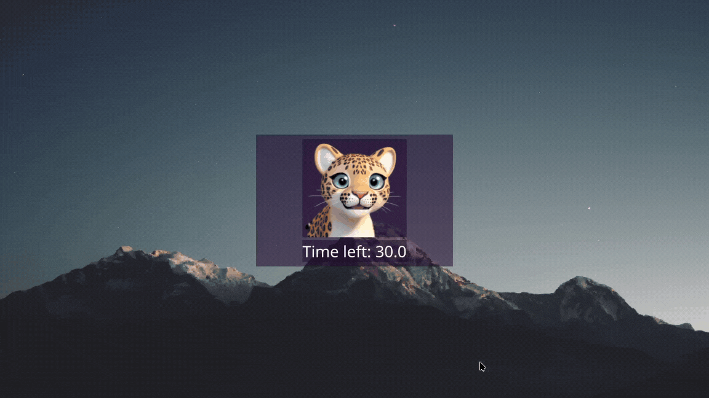

# PyLeo: Take Breaks for Your Health

A simple yet effective application designed to remind users to take occasional breaks, promoting digital wellbeing. This app helps reduce eye strain, improve posture, and maintain overall health while working long hours on a computer.



### Features
* Customizable Break Intervals: Set short or long breaks at intervals that suit your work schedule.
* Gentle Reminders: Notifications or pop-ups to remind you to pause and relax.
* Configurable Settings: Customize reminders, colors to match your theme.
* Lightweight: Minimal resource usage, ensuring smooth performance.

### Getting Started
#### Prerequisites
* Operating System: Windows/Mac/Linux
* Python3

#### Installation
1. Clone the Repository
```
git clone https://github.com/DarkMatter-999/PyLeo.git
cd PyLeo
```

2. Install Dependencies
```
pip3 install -r requirements.txt
```

3. Start the Application
```
python3 main.py
```
#### Customization
PyLeo can be customised by the systray icon.

App is built with Python using PyQt6, Inspired by **EyeLeo** for windows.

--- 
##### TODOs:
- [x] Basic short and long breaks GUI 
- [x] Config customization
- [ ] Image Animations
- [ ] Break texts and excercises
